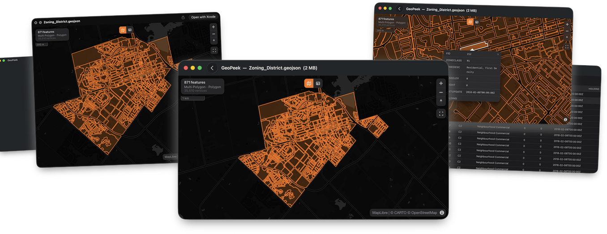
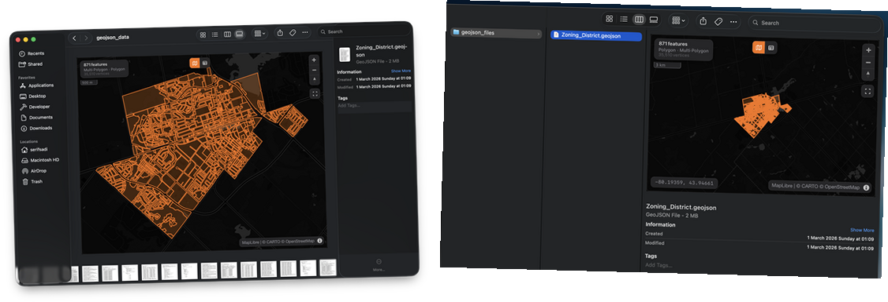

<p align="center">
  
</p>

<h1 align="center">GeoPeek</h1>

<p align="center">
  A lightweight macOS app and Quick Look extension for previewing GeoJSON files.
</p>

---

## Features

- **Interactive Map** — Renders GeoJSON on a MapLibre GL map with dark and light mode support
- **Quick Look Preview** — Press Space in Finder to instantly preview `.geojson` files
- **Thumbnail Generation** — See map thumbnails directly in Finder
- **Table View** — Toggle between map and attribute table with full feature properties
- **Feature Selection** — Click features on the map or rows in the table to inspect properties
- **Stats Panel** — Feature count, geometry types, and bounding box at a glance
- **Drag & Drop** — Open files by dragging them onto the app window
- **Error Handling** — Clear error display for invalid or corrupted GeoJSON files

## Screenshots

<p align="center">
  
</p>

### Finder Integration

<p align="center">
  
</p>

## Requirements

- macOS 14.0+
- Xcode 16+

## Installation

### From GitHub Releases

Download the latest `.dmg` from [Releases](https://github.com/serifsadi/geopeek/releases).

### Build from Source

1. Clone the repository:
   ```bash
   git clone https://github.com/serifsadi/geopeek.git
   ```
2. Open `GeoPeek.xcodeproj` in Xcode
3. Build and run (`Cmd + R`)

## Usage

- **Open a file** — Double-click a `.geojson` file, use `Cmd + O`, or drag and drop
- **Quick Look** — Select a `.geojson` file in Finder and press Space
- **Toggle view** — Switch between Map and Table using the toggle button at the top center
- **Inspect features** — Click a feature on the map to see its properties in a popup, or click a row in the table to zoom to it on the map

## Tech Stack

- Swift / AppKit
- WebKit (WKWebView)
- [MapLibre GL JS](https://maplibre.org/) for map rendering
- Quick Look & Thumbnail extensions

## License

This project is licensed under the MIT License — see the [LICENSE](LICENSE) file for details.
